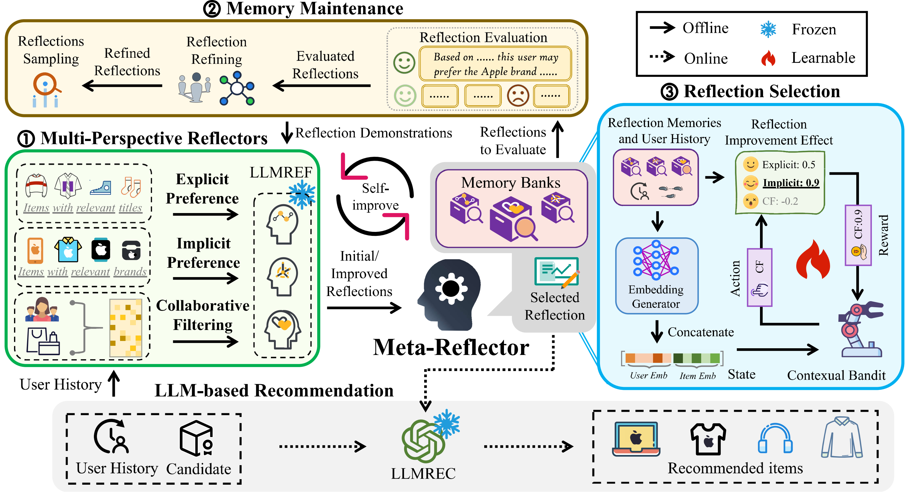

# $\texttt{MoRE}$: A Mixture of Reflectors Framework for Large Language Model-Based Sequential Recommendation

Official implementation of the submission [$\texttt{MoRE}$: A Mixture of Reflectors Framework for Large Language Model-Based Sequential Recommendation].

## Overview

## Prerequisites

See ``./environment.yml`` for details.

## Dataset Prepare

### prepare_cluster_user/prepare_data.py

This .py file is used to construct the CF model (DMF). To modify training configurations, adjust the settings in the `./prepare_cluster_user/DMF config/` for different datasets. Note: Please download the RecBole datasets first, then place them in the designated data folder and keep track of the path details.

> [Datasets download](https://recbole.io/dataset_list.html)
>
> Search for Amazon, and download the 2018 version which includes corresponding .item, .inter files; ensure all necessary files are included.

### prepare_cluster_user/pre_cu_sampled.py

It is used for constructing user clusters, with specifics aligning with the paper's internal details.

### prepare_cluster_user/get_samples.ipynb

It is used for constructing training, validation, and test samples, allowing lookup of corresponding user/item embeddings.

## Training & Evaluation

### ex_refl_refining_iteration.sh

This is the script for running experiments on the multi-perspective reflectors module as detailed in the original paper. You can refer to the corresponding parameters within and run according to your needs.

### ex_refl_selection_training.sh

This script is for running experiments on the reflection selection module as outlined in the original paper. You can reference the relevant parameters from here and execute as required.

### ex_refl_re_recommend.sh

This is the script to rerun recommendations and evaluate the performance on the test set after all modules have been trained, as described in the final section of the original paper. Relevant parameters can be referenced and executed according to your needs.

## Others

### ./prompt/

Translate to English, keeping it concise: This is the folder containing two types of prompts: recommendation prompts and reflection prompts.

### Meta-Llama-3-8B-Instruct-bf16

If you haven't downloaded the LLaMa-3 model, please download the LLaMa-3-8B model huggingface at this link:
[LLaMa-3-8B-bf16](https://huggingface.co/gradientai/Meta-Llama-3-8B-bf16)
